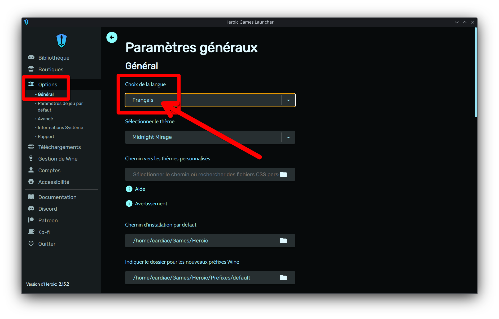
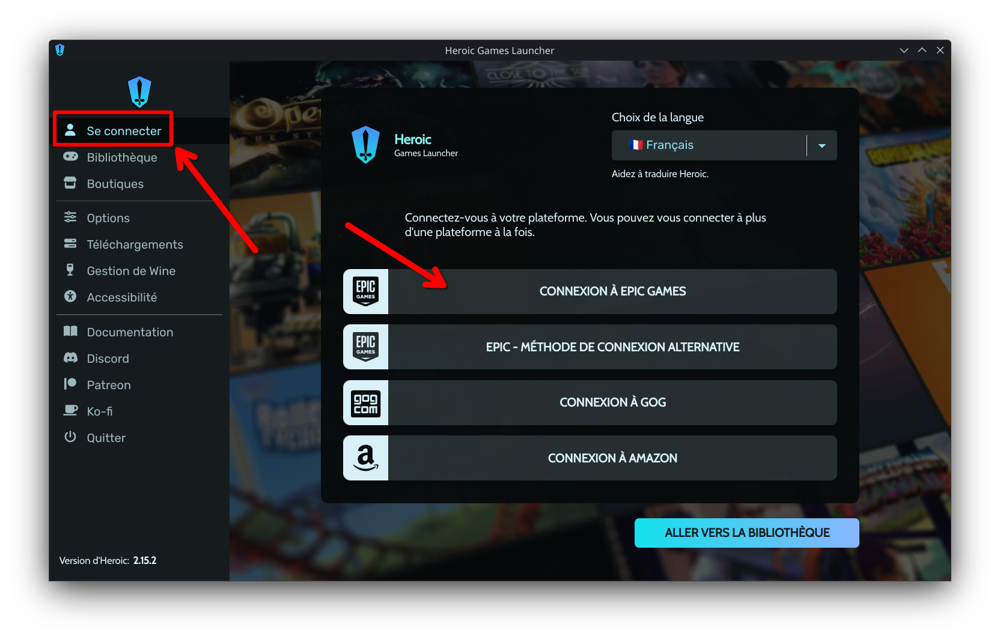
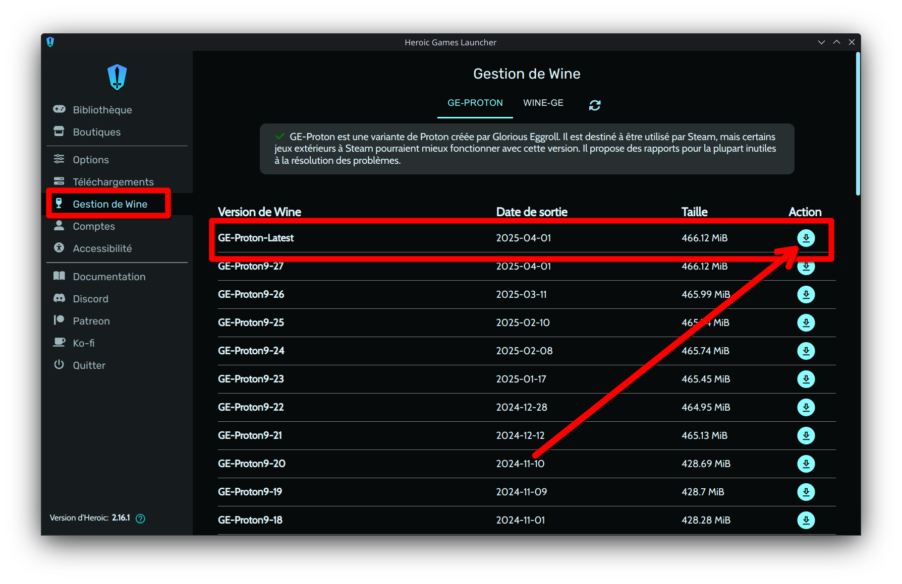
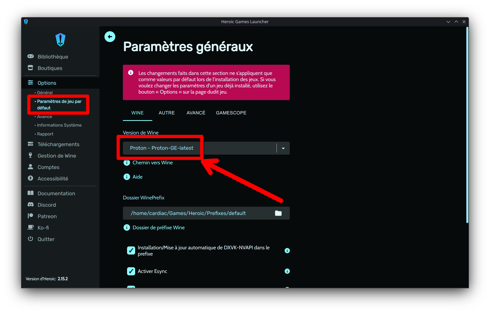
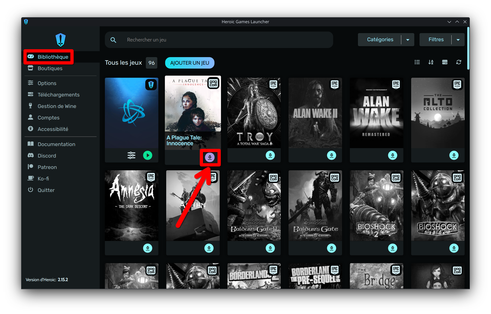
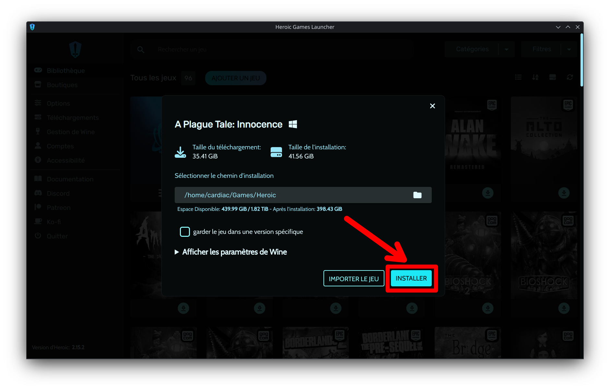
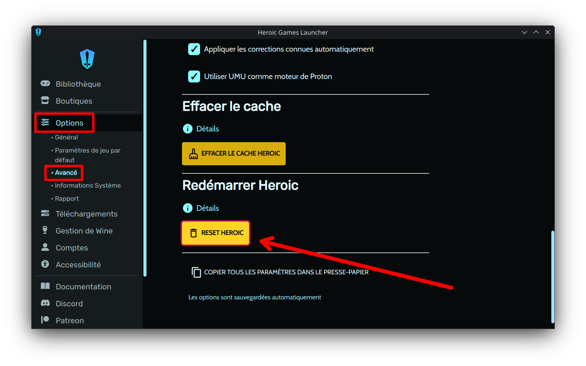

# Guide Heroic Game Launcher

**Heroic Game Launcher** permet de gérer et installer facilement vos jeux, notamment ceux d’Epic, GOG et Amazon.

   - *Ce guide est basé sur [la documentation officielle](https://github.com/Heroic-Games-Launcher/HeroicGamesLauncher/wiki/Linux-Quick-Start-Guide) qui recommande **umu** et **proton-ge-latest**.*

   - *Pour en savoir plus sur le moteur qui se cache derrière Heroic lisez : [Wine, Proton et UMU : Exécuter des jeux Windows sur Linux !](https://www.gaminglinux.fr/wine-proton-et-umu-executer-des-jeux-windows-sur-linux/)*

## Guide Rapide

1. **Langue**  
   - Dans **Options** → **Général**, réglez la **langue** de l’interface si nécessaire.

   

   Pour que la **méthode de connexion alternative** fonctionne, vous devez être connecté à votre compte Epic Game dans votre navigateur.

2. **Connexion**  
   - Lancez Heroic et cliquez sur **Connexion** (à gauche).  
   - Connectez-vous à vos comptes **Epic**, **GOG**, ou **Amazon** (possibilité de s’authentifier à plusieurs comptes).

   

3. **Installer Proton-GE**  
   - Ouvrez **Wine Manager** (menu à gauche).  
   - En haut, sélectionnez l’onglet **Proton-GE**.  
   - Téléchargez la dernière version en cliquant sur **Proton-GE Latest**.

   

4. **Définir Proton-GE par défaut**  
   - Dans **Options** → **Paramètres de jeu par défaut**, sélectionnez **proton-ge-latest** comme moteur par défaut.

   

5. **Installer et lancer un jeu**  
   - Ouvrez l’onglet **Bibliothèque**, choisissez un jeu et cliquez sur **Installer**.  
   - Lancez ensuite le jeu directement depuis Heroic.

   
   

---

## Résolution des problèmes : 

- Néttoyer le dossier umu avec la commande terminal :

   - Paquet système :
   `rm ~/.config/heroic/tools/runtimes`

   - Flatpak :
   `rm ~/.var/app/com.heroicgameslauncher.hgl/config/heroic/tools/runtimes/umu`

- Vérifier que mangohud est bien décoché : 

   - Dans **Options** → **Paramètres de jeu par défaut** → **Autre**

 Mangohud peut empêcher certains launcher de s'installer ou certains jeux de se lancer.

- Mettre toutes les options par défaut et effectuer le tutoriel à nouveau.

   - Dans **Options** → **Avancé** → **Reset Heroic**

- Autre solution plus radicale, dans un terminal : 
   
   - Paquet système :
   `rm ~/.config/heroic/`

   - Flatpak :
   `rm ~/.var/app/com.heroicgameslauncher.hgl/config/heroic/`

Fermez et ouvrez à nouveau Heroic, puis refaites le tutoriel à la lettre.

> *Pour plus d’informations, référez-vous à la [documentation officielle](https://github.com/Heroic-Games-Launcher/HeroicGamesLauncher/wiki/Linux-Quick-Start-Guide)
